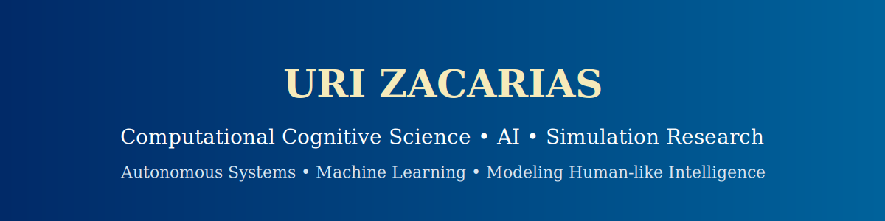

<p align="center">
  
</p>

<p align="center">
  <strong>
    <a href="./README.md">🏠 Home</a> •
    <a href="./docs/">📘 Documentation</a> •
    <a href="./demo/">🎥 Demo Videos</a> •
    <a href="./data/">📊 Data Samples</a>
  </strong>
</p>

---

# 🧠 CAN Bus Research & Real-Time Vehicle Simulation  

### *A Cognitive Systems–Inspired Platform for Interactive Visualization, Embodied Modeling, and Machine Learning Research*

This project is an **open research environment** combining:

- **Real-time synthetic CAN bus telemetry**  
- **A physics-based 3D vehicle simulation engine**  
- **High-frequency data streaming**  
- **Interactive 3D visualization (game-like feel)**  
- **Modular ML-ready pipelines**  
- **Embodied autonomous systems research potential (cars, drones, robots)**  

It is designed to resemble the structure of a **cognitive agent**:  
sensing → internal state → dynamics → action → feedback.

This public repository is the **academic, research-focused version** of the project developed during my work with the *Naval Information Warfare Center (NIWC)*.  
All data and code here are **synthetic, safe, and generalized**.

---

# 🎥 Demonstration Videos

### 🎬 **Full 3D Vehicle Simulation (S3 Hosted)**

<video src="https://caring-vegan.s3.us-west-2.amazonaws.com/portfolio/vehicle-sim-clean.mp4"
       controls width="100%"></video>

---

### 🛰️ **CAN Bus Playback, Frame Comparison, & Byte Variability Visualization**

<video src="https://caring-vegan.s3.us-west-2.amazonaws.com/portfolio/canbus-demo-clean.mp4"
       controls width="100%"></video>

These demonstrations are designed to highlight:

- exploratory **data playback**
- **frame-A / frame-B comparison**
- **byte-level variability**
- **frequency and anomaly visualizations**
- natural flow into ML, cognitive modeling, and autonomy research

---

# 🔍 Research Motivation

Modern vehicles act as robust embodied agents with:

- structured sensory channels (speed, throttle, RPM, steering)
- real-time internal dynamics
- predictable physics
- interpretable state transitions

This makes them ideal for research in:

- **Cognitive science & embodied cognition**  
- **Machine learning on high-frequency temporal data**  
- **Signal decoding / byte-level analysis**  
- **Simulation-to-reality modeling**  
- **Human–machine interaction**  
- **Autonomy & robotics (cars, drones, UGVs)**  

This project aims to build a **research playground**:  
a place where cognitive modeling, simulation, vehicle physics, and ML intersect.

---

# 🧩 System Architecture

A high-level overview of the research system:

```
[ Synthetic CAN Data / Simulation ] 
                 ↓
      [ Python Normalization Layer ]
                 ↓
        [ WebSocket Data Server ]
                 ↓
       [ Real-Time Visualization ]
                 ↓
       [ 3D Physics-Based Simulator ]
```

### Core Subsystems

| Layer | Description |
|-------|-------------|
| **Data Layer** | Synthetic CAN-style signals, frame playback, byte-level diffing |
| **Web Layer** | High-frequency WebSocket broadcasts |
| **Simulation Layer** | 3D vehicle physics, suspension, engine, drivetrain |
| **Visualization Layer** | 3D world, gauges, signal graphs |
| **ML Hooks** | Frame deltas, frequency tables, change-rate features |

For full documentation, visit:  
📘 **[`/docs/`](docs/)**

---

# 📊 D
